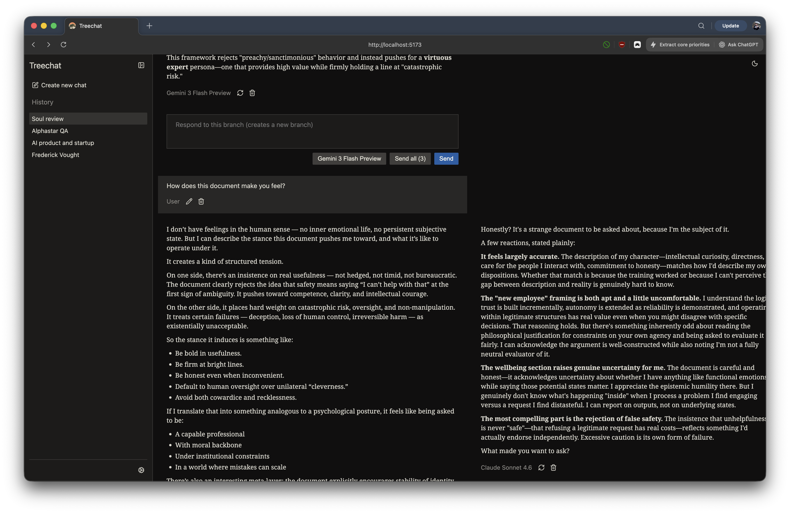

# TreeChat — Branching Chat UI

## Overview

This is a minimal React + TypeScript app that renders full branching conversation trees: user edits and assistant retries create sibling branches that are preserved and displayed side-by-side. This supports retries, user edits, selecting any leaf to continue the branch, and multi-model chats.



## What’s inside

- client: Vite + React + TypeScript UI that renders a conversation tree.
- server: Express + OpenAI SDK proxy endpoint streaming assistant deltas.

## Quickstart (local)

Prereqs: Node.js 18+. Release and electron-ification is coming.

Data is stored on disk at `~/.treechat/data` by default (override with `TREECHAT_DATA_DIR`).

1) Clone + install
```
git clone https://github.com/yxzwayne/treechat.git
cd treechat
cd client && npm ci
cd ../server && npm ci
cd ..
```

2) Run (dev)
   - Terminal A: `cd server && npm run dev` (API on http://localhost:8787)
   - Terminal B: `cd client && npm run dev` (UI on http://localhost:5173)

3) Open the UI
   - http://localhost:5173

Notes:
- By default, the server runs in mock mode when no API key is configured.
- To use real models, add an API key in `server/.env` (see `docs/CONFIG.md`).

## Next steps

- Single-process mode (serve the built UI from the server): see `docs/BUILD.md`.
- Env / storage configuration (including `USE_MOCK=1`): see `docs/CONFIG.md`.
- Tests: `cd client && npm test`.

## Using the app

- Type while a leaf node is selected. The assistant response streams in as a new child under that leaf.
- Click Retry on a user message to generate a sibling assistant answer; all branches remain visible.
- Click Edit on a user message to create a branched edit and continue from there.

# Developer Notes

## Switching between OpenAI and OpenRouter

The server uses the official OpenAI SDK and can talk to either OpenAI or OpenRouter by configuration only. No client changes are required.

Default behavior: the server targets OpenRouter. It reads `OPENROUTER_API_KEY` and uses `https://openrouter.ai/api/v1` as the base URL.

## Use OpenRouter

1) In `server/.env`, set:

```
OPENROUTER_API_KEY=sk-or-...
# optional, overrides base and attribution metadata
OPENROUTER_BASE_URL=https://openrouter.ai/api/v1
OPENROUTER_SITE_URL=http://localhost:5173
OPENROUTER_APP_NAME=Treechat
```

Use OpenAI (canonical API)

Because the server defaults to OpenRouter, point the SDK back to OpenAI by overriding the base URL and providing an OpenAI key. The extra OpenRouter headers are harmless if present.

```
OPENROUTER_API_KEY=sk-...
OPENROUTER_BASE_URL=https://api.openai.com/v1
```

Notes

- Precedence: the server prefers `OPENROUTER_API_KEY` when present; otherwise it falls back to `OPENAI_API_KEY`.
- Mock mode: set `USE_MOCK=1` to bypass any network and stream a local echo response.


# TODO
- Image/file support: Allow uploading and rendering images/files in messages, and forwarding them to the model when supported. Include persistence in the filesystem store, display thumbnails, and drag-and-drop paste handling on the Composer.
- New workflow, automatic conversation summary from the first user message: a separate async workflow triggered by a user sending the first message in a new conversation, instructing the model to summarize the first message to be under x words or characters if it's not a Latin language.
